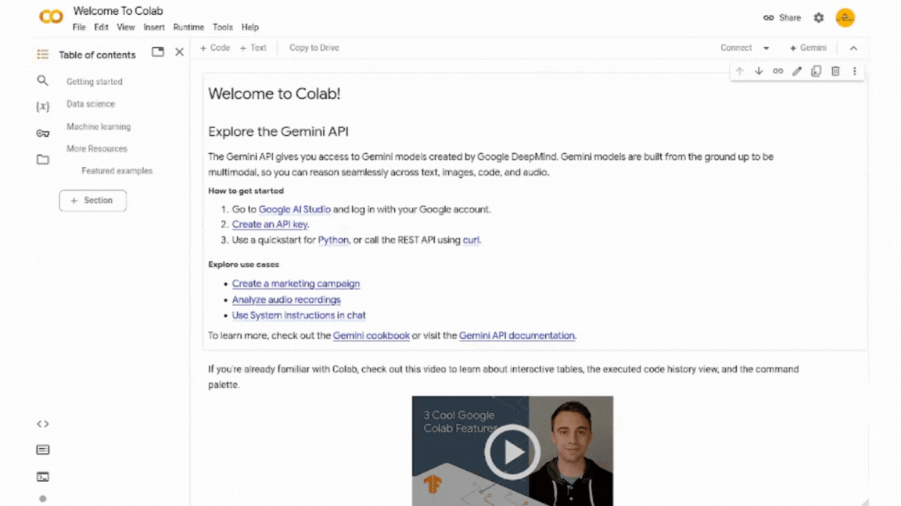

# Python 2025

Repositorio donde se encuentran los archivos de las clases de Python 2024.

## Clases

| Clase | Tema | Fecha |
| --- | --- | --- |
| [Clase 0](./Clase%200/Sintaxis%20basica%20y%20tipos%20de%20datos.ipynb) | Sintaxis básica y tipos de datos | 17 de mayo |
| [Clase 1](./Clase%201/Estructuras%20de%20Control.ipynb) | Estructuras de Control | 31 de mayo |
| [Clase 2](./Clase%202/Bucles%20+%20Listas.ipynb) | Bucles + Listas | 6 de junio |
| [Clase 3](./Clase%203/Funciones.ipynb)| Funciones | 14 de junio |
| [Clase 4](./Clase%204/Sets%20+%20Diccionarios.ipynb)  | Sets + Diccionarios | 21 de junio |

## Cómo abrir las clases en Google Colab

Abre Google Colab y copia el link `https://github.com/ACOIIN/Python-2025` y pégalo tal y como se muestra en el siguiente gif.

